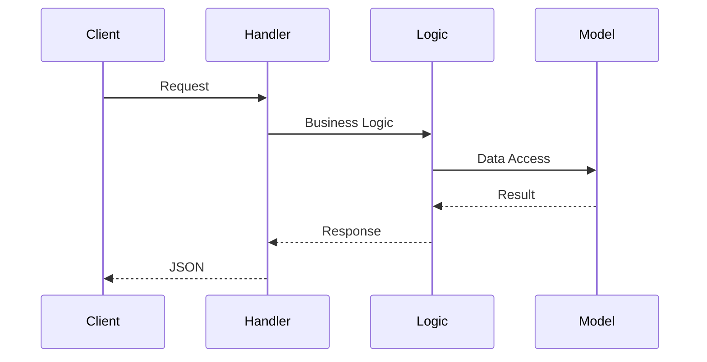

# {{feature_name}} Technical Plan

> Generated by Spec Kit | IDRM Project

## Architecture Overview
遵循 IDRM 分层架构：Handler → Logic → Model

## ORM Strategy
<!-- GORM vs SQLx 选择及理由 -->
- [ ] GORM（复杂查询、关联）
- [ ] SQLx（简单查询、性能）

## File Structure
```
model/{module}/{feature}/
├── interface.go
├── types.go
├── vars.go
├── factory.go
├── gorm_dao.go
└── sqlx_model.go

api/internal/logic/{module}/{feature}/
├── create{feature}logic.go
├── get{feature}logic.go
└── ...

api/internal/handler/{module}/{feature}/
└── ...
```

## Interface Definitions
```go
type Model interface {
    Insert(ctx context.Context, data *T) (*T, error)
    FindOne(ctx context.Context, id int64) (*T, error)
    Update(ctx context.Context, data *T) error
    Delete(ctx context.Context, id int64) error
    WithTx(tx interface{}) Model
    Trans(ctx context.Context, fn func(ctx context.Context, model Model) error) error
}
```

## Sequence Diagrams


## Technical Constraints

### IDRM 通用约束
- MUST follow layered architecture (Handler → Logic → Model)
- MUST implement dual ORM support
- Functions MUST be < 50 lines
- MUST use Chinese comments
- Error wrapping MUST use %w
- Test coverage MUST be > 80%

### 功能特定约束
<!-- 性能、安全、特定限制 -->

## Data Model

### DDL
```sql
-- migrations/{module}/{table}.sql
CREATE TABLE `{table}` (
    `id` bigint unsigned NOT NULL AUTO_INCREMENT,
    -- fields
    `created_at` datetime NOT NULL DEFAULT CURRENT_TIMESTAMP,
    `updated_at` datetime NOT NULL DEFAULT CURRENT_TIMESTAMP ON UPDATE CURRENT_TIMESTAMP,
    `deleted_at` datetime DEFAULT NULL,
    PRIMARY KEY (`id`)
) ENGINE=InnoDB DEFAULT CHARSET=utf8mb4;
```

### Go Struct
```go
type Entity struct {
    Id        int64     `gorm:"primaryKey"`
    CreatedAt time.Time
    UpdatedAt time.Time
    DeletedAt gorm.DeletedAt
}
```

## API Contract
见 `{feature}.api` 文件

## Testing Strategy
- 单元测试：表驱动测试，Mock Model 接口
- 集成测试：测试数据库
- 覆盖率：> 80%
