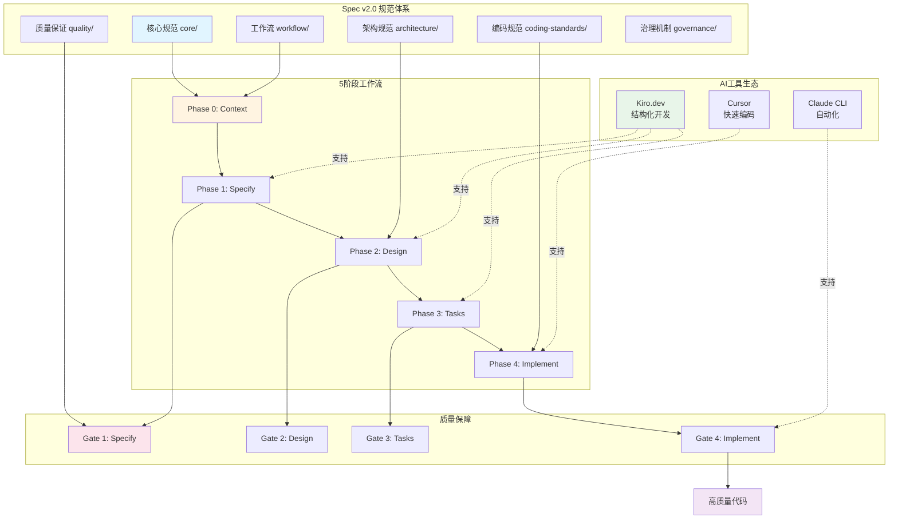
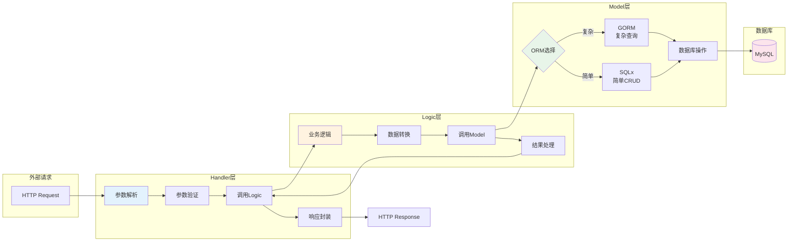
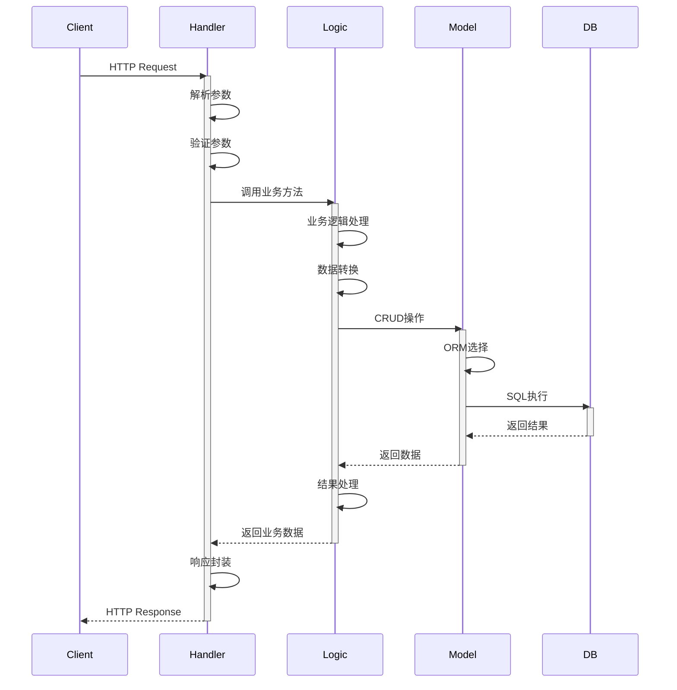
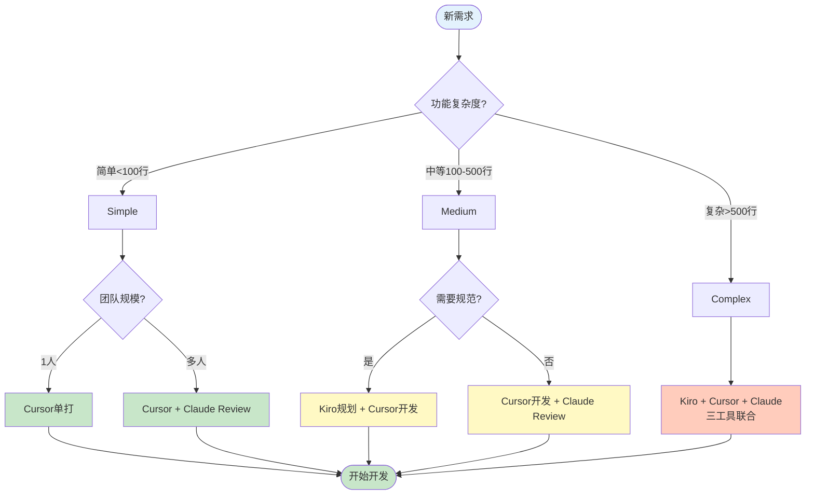
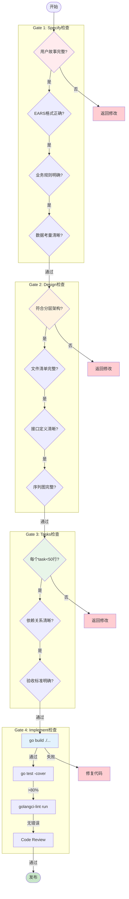
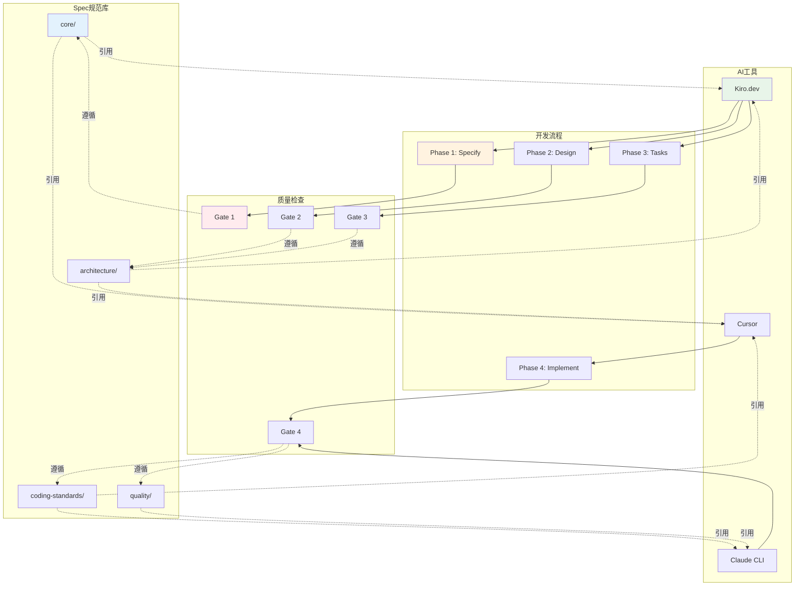

# 架构图和流程图

> 可视化理解IDRM AI编程体系

---

## 🏗️ 整体架构图

### IDRM AI编程体系架构

---

## 🔄 5阶段工作流详细流程

### 完整开发流程

```mermaid
flowchart TD
    Start([开始新功能]) --> P0{Phase 0: Context}
    
    P0 --> P0_1[阅读核心规范]
    P0_1 --> P0_2[理解架构规范]
    P0_2 --> P0_3[准备开发环境]
    P0_3 --> P0_Check{环境就绪?}
    P0_Check -->|否| P0_1
    P0_Check -->|是| P1
    
    P1[Phase 1: Specify] --> P1_1[编写用户故事]
    P1_1 --> P1_2[定义验收标准<br/>EARS格式]
    P1_2 --> P1_3[明确业务规则]
    P1_3 --> P1_4[定义数据考量]
    P1_4 --> G1{Gate 1检查}
    G1 -->|不通过| P1_1
    G1 -->|通过| P2
    
    P2[Phase 2: Design] --> P2_1[架构设计]
    P2_1 --> P2_2[文件结构规划]
    P2_2 --> P2_3[接口定义]
    P2_3 --> P2_4[序列图设计]
    P2_4 --> G2{Gate 2检查}
    G2 -->|不通过| P2_1
    G2 -->|通过| P3
    
    P3[Phase 3: Tasks] --> P3_1[任务拆分<br/>每个<50行]
    P3_1 --> P3_2[定义依赖关系]
    P3_2 --> P3_3[明确验收标准]
    P3_3 --> G3{Gate 3检查}
    G3 -->|不通过| P3_1
    G3 -->|通过| P4
    
    P4[Phase 4: Implement] --> P4_1[逐个实施Task]
    P4_1 --> P4_2[编写测试]
    P4_2 --> P4_3[Self Review]
    P4_3 --> P4_4[运行测试]
    P4_4 --> G4{Gate 4检查}
    G4 -->|编译失败| P4_1
    G4 -->|测试失败| P4_2
    G4 -->|Lint失败| P4_1
    G4 -->|全部通过| P4_5[Peer Review]
    P4_5 --> P4_6{Review通过?}
    P4_6 -->|否| P4_1
    P4_6 -->|是| End([功能完成])
    
    style P0 fill:#e3f2fd
    style P1 fill:#fff3e0
    style P2 fill:#e8f5e9
    style P3 fill:#fce4ec
    style P4 fill:#f3e5f5
    style G1 fill:#ffebee
    style G2 fill:#ffebee
    style G3 fill:#ffebee
    style G4 fill:#ffebee
    style End fill:#c8e6c9
```

---

## 🏛️ 分层架构详图

### Handler → Logic → Model

### 数据流向

---

## 🛠️ AI工具协作流程

### 三工具协同开发

```mermaid
flowchart LR
    subgraph "Kiro.dev - 规划阶段"
        K1[创建Spec]
        K2[生成Requirements]
        K3[生成Design]
        K4[生成Tasks]
        
        K1 --> K2
        K2 --> K3
        K3 --> K4
    end
    
    subgraph "Cursor - 开发阶段"
        C1[读取Tasks]
        C2[编写代码]
        C3[编写测试]
        C4[Self Review]
        
        C1 --> C2
        C2 --> C3
        C3 --> C4
    end
    
    subgraph "Claude CLI - 质检阶段"
        L1[批量Review]
        L2[生成测试]
        L3[质量报告]
        
        L1 --> L2
        L2 --> L3
    end
    
    K4 -->|导出specs| C1
    C4 -->|提交PR| L1
    L3 -->|发现问题| C2
    
    L3 --> Done[合并代码]
    
    style K1 fill:#e8f5e9
    style C1 fill:#e3f2fd
    style L1 fill:#fff3e0
    style Done fill:#c8e6c9
```

### 工具选择决策流程

---

## ✅ 质量门禁流程

### 4个Gate详细检查

---

## 🚀 典型场景流程图

### 场景：新增API接口

```mermaid
flowchart TD
    Start([需求：添加API]) --> Step1[Phase 1: Specify]
    
    Step1 --> S1_1[定义接口路径<br/>GET /api/v1/xxx]
    S1_1 --> S1_2[EARS验收标准]
    S1_2 --> S1_3[数据结构定义]
    S1_3 --> Check1{Gate 1}
    Check1 -->|通过| Step2[Phase 2: Design]
    Check1 -->|不通过| Step1
    
    Step2 --> S2_1[Handler设计<br/>xxxhandler.go]
    S2_1 --> S2_2[Logic设计<br/>xxxlogic.go]
    S2_2 --> S2_3[Model接口]
    S2_3 --> Check2{Gate 2}
    Check2 -->|通过| Step3[Phase 3: Tasks]
    Check2 -->|不通过| Step2
    
    Step3 --> S3_1[Task 1: Handler]
    S3_1 --> S3_2[Task 2: Logic]
    S3_2 --> S3_3[Task 3: 测试]
    S3_3 --> Check3{Gate 3}
    Check3 -->|通过| Step4[Phase 4: Implement]
    Check3 -->|不通过| Step3
    
    Step4 --> S4_1[Cursor生成Handler]
    S4_1 --> S4_2[Cursor生成Logic]
    S4_2 --> S4_3[Cursor生成测试]
    S4_3 --> S4_4[运行测试]
    S4_4 --> Check4{Gate 4}
    Check4 -->|失败| S4_1
    Check4 -->|通过| S4_5[Code Review]
    S4_5 --> S4_6{Review通过?}
    S4_6 -->|否| S4_1
    S4_6 -->|是| End([API完成])
    
    style Step1 fill:#fff3e0
    style Step2 fill:#e8f5e9
    style Step3 fill:#e3f2fd
    style Step4 fill:#f3e5f5
    style End fill:#c8e6c9
```

---

## 📊 数据流转图

### Spec规范如何贯穿整个流程

---

## 📖 使用说明

### 如何阅读这些图表

1. **整体架构图** - 了解AI编程体系全貌
2. **5阶段流程图** - 理解完整开发流程
3. **分层架构图** - 掌握代码组织方式
4. **工具协作图** - 选择合适的工具组合
5. **质量门禁图** - 明确每个检查点
6. **场景流程图** - 快速上手实际开发

### 图表在文档中的应用

所有图表都可以嵌入到相关文档中：
- 整体架构图 → 核心理念
- 工作流程图 → 5阶段概览
- 分层架构图 → 规范体系
- 工具协作图 → 工具组合
- 质量门禁图 → 质量门禁
- 场景流程图 → 各个场景文档

---

**图表让理解更直观！** 📊
